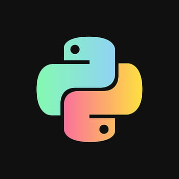

# ecommerce_Jon_Compass
Este é um e-commerce para empresa Jon, feito em P´HP e MYSQL. (treinamento Compass)

Vamos criar um e-comerce para a empresa x e blablabla

# Funcionalidades:

checkout, tela de produto, catálago, Home com banner

## Melhorias do Projeto:

Melhoria 1, Melhoria 2

## Imagem Local:




## Links interesssantes:

[google](https://www.google.com)

[https://compass.uol/en/home/](https://compass.uol/en/home/)

## Código da função soma:

``` javascript
    function soma(a,b){
        return a + b;
    }
``` 